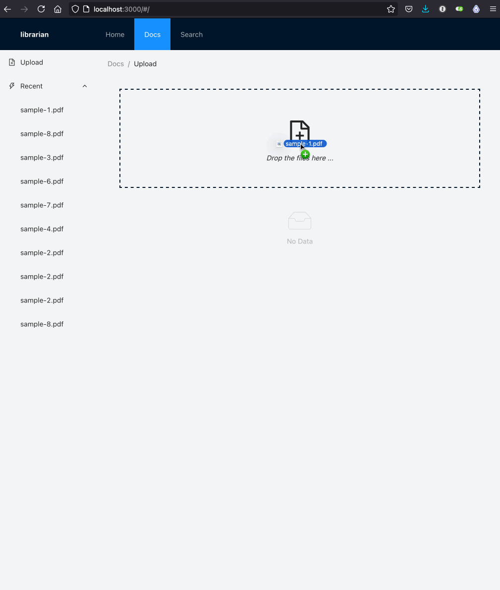

# Librarian

Librarian is a high-quality, self-hosted app for your documents.

Features

* configurable, automatic backups to a NAS (over NFS)
* document OCR (via Google Compute Vision)
* document search



## Contributing

### Prerequisites

Tools used to build Librarian

* make
* [npm](https://www.npmjs.com/get-npm)
* python (>3.9)
* poetry
* [libnfs](https://github.com/sahlberg/libnfs)
* imagemagick

On macOS via Homebrew

```
$ brew install node python@3.9 poetry libnfs imagemagick 
```

### Installation

The following secrets need to be set in the environment

```bash
export NFS_PATH="nfs://192.168.1.1/volume1/librarian"
export GOOGLE_APPLICATION_CREDENTIALS="/Users/nathan/gcv-key.json"
export SECRET_KEY="nvm5k(6t%ybnfd+8*)9r9p@hatnm#1%w3yx(#o1+zo44x2b3yd"
```

For the backend

```bash
$ make migrate
$ make run
```

For the frontend

```bash
$ npm i
$ npm start
```

See [Makefile](Makefile) for additional commands.

### Environment variables

| Name | Default | Example | Description |
| --- | --- | --- | --- |
| NFS_PATH | None | nfs://192.168.1.1/volume1/librarian | Path to an NFS folder to backup documents to |
| GOOGLE_APPLICATION_CREDENTIALS | None | /Users/nathan/gcv-key.json | Path a JSON file containing service account credentials for Google Compute Vision |
| SECRET_KEY | None | nvm5k(6t%ybnfd+8*)9r9p@hatnm#1%w3yx(#o1+zo44x2b3yd | Secret key for Django -- can generate one with `python -c 'from django.core.management.utils import get_random_secret_key; print(get_random_secret_key())'` |

### Scripts

Test uploads without drag-n-dropping on the frontend

```
$ curl 'http://0.0.0.0:8000/api/documents/home-title.pdf' -H 'Content-Type: application/pdf' --data-binary  '@home-title.pdf'
```

### Roadmap

See [roadmap.md](ROADMAP.md)
